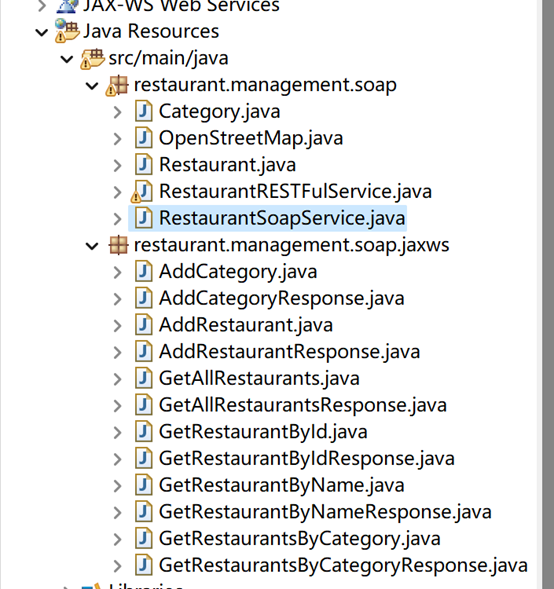

# **WebService (Restaurant Management Service)**

### Introduction

As a matter of fact, as students of CY Cergy Paris University, this project was chosen by us from the optional themes provided by our teachers.

As a common tool in our life, I can't hang out in Paris without citymapper or GoogleMaper, so the opportunity to get deeply involved in the development of this kind of software was undoubtedly very attractive to us!
Therefore, we decided to get in touch with the map api as early as possible to understand its working mechanism. At the same time, we considered the possibility of a future career in software development or operations and testing. Finally, we were also attracted by the fun nature of this project. So we chose it.

### The purpose of the project

##### The main purpose

The project aims to construct a web service to implement the following features : 

1. Allow customers to create restaurants, including their address and restaurant category.
2. Allows all database operations to be performed on category, id, etc. through the database
3. Allow clients to get all geographic information about a restaurant by calling the API and entering the name of the restaurant.
4. Allows the client to permanently store the data in a web database.


##### The Components 

1. For database selection, we chose PostgreSql, which we had already learned, as the database language, and then we chose alwaysdata as our web database hosting platform
2. For the choice of API technology, after trying several map api's, we decided to use the Nominatim API as our primary API tool
3. In addition, we also use the json jar package to process the data returned by the api, so that the data transmission process has higher robustness and better processing accuracy.
4. use postman for test and Temporary Client side.


### The description 

The project requires us to implement the same theme in two different ways ( Soap and RESTful ). We will describe our idea about how to implement it, but before this, we have to introduce the structure of database and usage of Nominatim API.


##### Database

As described above, we designed two tables 'cates' and 'rests' who were connected by a relation like the figure following.


That is to say, a tuple of the table 'cates' contains a lot of restaurants in the table 'rests' who has the same id_c like the tuple. But a restaurant belongs to only a category. The DDL we provide is shown below.

```sql
CREATE TABLE Cates(
    id_c varchar(3) NOT NULL,
    name_c varchar(20) NOT NULL ,
    constraint Cates_pk primary key (id_c)
);

CREATE TABLE Rests(
    id_r SERIAL NOT NULL,       -- id auto-augment
    name_r varchar(30) NOT NULL,
    lon_r numeric,              
    lat_r numeric,             
    adr_r varchar(150) NOT NULL,
    id_c varchar(3),
    constraint Rests_pk primary key (id_r),
    constraint Rests_fk foreign key (id_c) references Cates(id_c)
);

-- We have provided some data for testing
INSERT INTO cates(id_c, name_c) VALUES ('1','French'),('2','Italian'),('3','Chinese'),('4','Korean'),('5','Japanese'),('6','English');

Insert Into rests(id_r, name_r, lon_r, lat_r, adr_r, id_c) VALUES 
(DEFAULT,'Plancha Grill',2.079,49.048,'60 Chau. Jules César, 95300 Pontoise','3'),
(DEFAULT,'Olie e Farina Paris',2.373,48.841,'30 Quai de la Rapée, 75012 Paris','2'),
(DEFAULT,'JMT - Jon Mat Taeng Paris',2.374,48.836,'63 Quai de la Gare, 75013 Paris','4'),
(DEFAULT,'Pedra Alta',2.303,48.868,'25 Rue Marbeuf, 75008 Paris','1'),
(DEFAULT,'Zuzuttomo',2.347,48.868,'10 Rue Poissonnière, 75002 Paris','5'),
(DEFAULT,'Saveurs Gourmandes',2.081909134262767,49.0467208,'10 Rue Poissonnière, 75002 Paris','3');

drop table if exists Rests;
drop table if exists Cates;

```

We directly incorporate the latitude and longitude information about the restaurant into the design scope of the database. Rather than repeatedly calling external api, we thought it would be better to add the information directly to the rests table and only need to interact with the database later. In the step of adding a restaurant, directly pull the latitude and longitude information of the restaurant.


##### Nominatim API

It allows to call an external service to get the latitude and longitude of a given restaurant or a given address, here is the URL of the api. we enter the name of the restaurant we want to find and it will return the first result in "json" format. This is then converted to a json array and then the data is partitioned

```javascript
https://nominatim.openstreetmap.org/search?q=<restaurantName>&format=json&limit=1
```

We restrict the results to prevent any renamed data from entering the database


##### Database, API, Client Interaction Design:
When calling the API to obtain geographic information, we believe that repeatedly calling the api to obtain data will lead to a waste of resources, so we optimized this process, adjusted it so that when the client initiates a query will not call the API first, but first go to the database to query the corresponding data, if you can not find the corresponding data in the database, then go to call the API to obtain the new restaurant's If the corresponding data cannot be found in the database, then the API will be called to get the new restaurant's geographic location information and then the data will be entered into the database and then the result will be returned to the client.
对于之后的RESTFul客户端和SOAP客户端都采用了这种设计


##### RESTful

###### Services' description

We created a web dynamic project named '<u>restaurant.management.web</u>' and 3 packages: data, resource and service.  The package data, it contains 2 data models : Category and Restaurant. The package service contains a class 'RestaurantService' who implement the logique of the services. And the package resource contains a class 'RestaurantResource' who returns the results  gotten by the service in the format XML. 


First of all, the class Category has some attributs, for example id and the corresponding name. And about the class Restaurant, some attributs like name, address, cateId, Lon(longitude) and Lat(Latitude). 

Then the class RestaurantService, it implement the main service, like adding a restaurant to database, searching a restaurant by its name, searching some restaurants by a given category and adding a new category as mentioned above, etc. And a tool class named PostgresqlJDBC who encapsulates the main code for database connections and resource release to make it easier for us to establish connections to the database and to release connections.

Finally, the class RestaurantRessource calls these services offered by RestaurantService and encapsulates the data returned by service in XML form and returns the data to the client. The URL addresses of these services are as follows.

| Method | Service's name      | Corresponding path           |
| ------ | ------------------- | ---------------------------- |
|        | (the root path)     | /                            |
| @POST  | addRestaurant       | /restaurants                 |
| @GET   | getRestaurantByName | /restaurants/name/{name}     |
| @GET   | getRestaurantByCate | /restaurants/category/{cate} |
| @POST  | addCategory         | /categories/category         |
| @GET   | getRestaurant_BD_Id | /restaurants/id/{id}         |
| @GET   | getAllRestaurants   | /restaurants                 |


After constructing these services, we run the Tomcat server and use <u>Postman</u> to check. If you follow the above steps, by default the web service's url is like this :

```
http://localhost:8082/restaurant.management.web/api/
```


For example, I want to check all the korean restaurants, so we should test the following url if that works.

```
http://localhost:8082/restaurant.management.web/api/restaurants/category/Korean
```


The final result of all operations will be reflected in the WADL  


### Client design

##### SOAP

###### Services' description

We created also a web dynamic project named '<u>RestaurantSoapService.service</u>'. This class is to implement the soap client, while reusing other functionality in the RESTFul client code 


1. getAllRestaurant
2. getRestaurantByName
3. addCategory
4. addRetaurant
5. getRestaurantById
6. getRestaurantByCategory

After we create the soap service code, we generate the client code by creating webservice in the web service, and then compile the client by compiling the WSDL code file.




In turn, we can access it to check the changes of XML


# 


